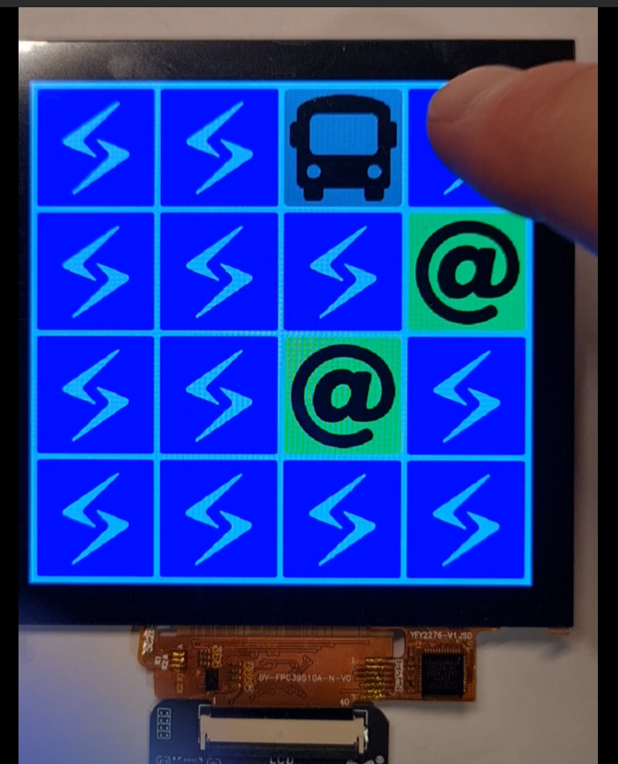

# Slit Memory Game Demo on LuckFox Pico Ultra W (armv7l) 

## Overview

This repository contains a simple Slint memory game demo application written in Rust, designed to run on the LuckFox Pico Ultra W (armv7l) platform.



## Setup

1. Install Rust and Cargo if not already installed. Follow instructions at [rustup.rs](https://rustup.rs/).
2. Install the required Rust target for cross-compilation:

   ```bash
   rustup target add armv7-unknown-linux-gnueabihf
   ```

3. Install the ARM cross-compiler toolchain:

   ```bash
   sudo apt-get install gcc-arm-linux-gnueabihf
   ```

4. Install cross for easier cross-compilation:

   ```bash
   cargo install cross --git https://github.com/cross-rs/cross
   ```

5. Build the project for the ARM target:

   ```bash
   cross build --target armv7-unknown-linux-gnueabihf --workspace --exclude slint-node --exclude pyslint --release
   ```

6. Transfer the compiled binary from `target/armv7-unknown-linux-gnueabihf/release/hello_world_slint_rust` to your LuckFox Pico Ultra W device:

   ```bash
   scp target/armv7-unknown-linux-gnueabihf/release/memory_slint pico@192.168.178.23:/home/pico/slint/memory_slint
   ```

7. On the target board install [requirements](https://github.com/slint-ui/slint/blob/ea0d0be0325f505c0c885f9f60aadf4b0da12a36/docs/building.md?plain=1#L38)

8. Run the application on the device:

   ```bash
   sudo ./memory_slint
   Using Software renderer
   Rendering at 720x720
   ```

## Notes

Check if you've got a hard or soft float processor by running:

```bash
readelf -A /bin/ls | grep Tag_ABI_VFP_args
```

If it shows

```bash
Tag_ABI_VFP_args: VFP registers
```

then it's a hard float target.
